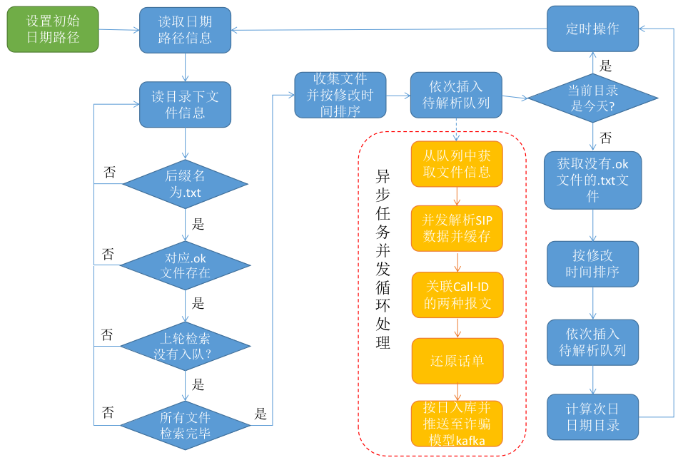

# 世纪网通话单还原系统安装使用说明书

#### 系统方案


- 1、话单还原系统按时间顺序并发读取VOIP原始数据进行解析，提取重要字段信息，筛检出INVITE-200OK与BYE-200OK两种数据包；

- 2、同一VOIP通话中，INVITE-200OK与BYE-200OK两个包Call-ID相同，先处理到哪个包就放入Redis缓存，后处理的包通过Call-ID从Redis中取出对应的包，经过关联处理还原出一条话单；

- 3、还原的话单立即推送至kafka服务并入库，数据库增加诈骗标识字段，增加被叫号码归属地省市字段，用于话单分析使用；

- 4、“话单分析”程序做成集群，从kafka拿取话单，存入ES中，话单量非常大，方便做话单分析，如果分析出是诈骗，则需要反向修改数据库，标识为“冒充公检法”。

#### 处理流程



#### 运行环境

注意：此部分仅包含话单还原部分

| 序号 | 服务名称 | 硬盘 | 内存 | 硬盘 |备注 |
| ---- | ----- | ---- | ---- | ---- |---- |
| 1    | centnet-cdrrs | E5 16cores |32G  | 500G |主程序，系统：CentOS7.8x64   |
| 2    | Redis5.0         |E5 8cores| 32G  | 500G |话单还原过程中缓存临时数据   |
| 3    | MySQL5.7.29      |E3 8cores| 16G  | 2T   |话单存储数据库   |
| 4    | Kafka_2.12-2.4.0 |E3 8cores| 16G  | 1T   |诈骗分析模型推送服务   |
| 5    | Zookeeper ||   |    |Kafka内置，共用服务器   |

#### 系统指标

* 系统处理有效话单量：3.5w/s，数据量：7w/s
* 系统只处理被叫为手机号码或国内固话，其他直接丢弃
* 话单每天分表入库

### centnet-cdrrs安装

*请先安装好MySQL、Redis、kafka/zookeeper环境后，再安装话单还原系统。*

#### 安装软件

* 将`centnet-cdrrs_1.0.0.zip`上传至服务器`root`目录下，解压进入

```shell
# unzip centnet-cdrrs_1.0.0.zip
# cd centnet-cdrrs_1.0.0
# ls
bin      cdrrs.sh conf     log      scripts
```

* 给主程序和其他脚本赋可执行权限

```shell
# chmod 777 cdrrs.sh bin/centnet-cdrrs
```

* 创建数据库，并导入运行依赖库表

找到话单还原主程序顶层目录，进入`scripts`目录。

```shell
cd scripts

# 创建话单数据库，或通过navicat创建数据库，sql语句在create_db.sql中
mysql -uroot -p < ./create_db.sql
Enter password:

# 导入phone_position.sql到centnet_cdrrs数据库，时间过长也可以通过navicat工具导入
mysql -uroot -p centnet_cdrrs < ./phone_position.sql
Enter password:
```
#### 修改配置

配置文件在主程序顶层目录下`./conf/config.toml`，使用`vim`打开文件，修改相关配置。**请修改注释为“必须修改”的参数项**

```toml
# config for centnet-cdrrs
# created by Wayne Yao, 2020-11-17

# 日志相关配置
[logging]
    logPath = "./log"
    logFile = "main.log"
    fileLevel= "DEBUG"
    consoleLevel = "DEBUG"
    maxAge = 7
    maxSize =  10

# 解析原始数据文件配置
[fileParser]
	# 以过滤规则ID命名的绝对路径
    rootPath = "/home"										# 必须修改
    # 开始解析哪天目录下的文件
    startDatePath = "202012/20201201"					# 必须修改
    # 最大并发解析线程数
    maxParseProcs = 36									

# 话单数据库配置
[mysql]
	# 连接地址，格式为user:password@tcp(host:port)/db_name?paramters...
    dsn = "centnet_cdrrs:123456@tcp(192.168.1.205:3306)/centnet_cdrrs?timeout=10s&readTimeout=10s&writeTimeout=10s&parseTime=true&loc=Local&charset=utf8,utf8mb4"
    													# 必须修改
    # 话单缓存刷新间隔，单位：秒
    flushPeriod = 10
    # 话单批量插入条数
    maxFlushCapacity = 10000
    # 话单缓存最大数量
    maxCacheCapacity = 50000

# 缓存服务配置
[redis]
	# 主机地址
    host = "192.168.1.205:6379"							# 必须修改
    # 为空，不填
    password = ""
    idleTimeout = 600
    maxIdle = 10
    maxActive = 10000
    # 缓存失效时间默认为1h
    cacheExpire = 3600

[kafka]
    # 诈骗模型服务
    [kafka.fraudModelProducer]
    	# 默认关闭，不推送数据。诈骗模型部署后可打开
        enable = false									# 用时修改
        topic = "CDR"									# 必须修改
        broker = "192.168.1.225:9092"					# 必须修改
        frequency = 500
        maxMessage = 100000
```

#### 系统运行
* 终端运行

```shell
# ./cdrrs-server-start.sh
```

* 后台运行

```shell
# ./cdrrs-server-start.sh -daemon
```

* 停止运行

```shell
# ./cdrrs-server-stop.sh
```

### MySQL安装

见《CentOS7安装MySQL5.7.md》

#### MySQL关闭binlog机制

**说明：MySQL binlog是记录数据库变更修改的二进制日志。话单数据库会高并发插入话单数据，binlog机制会影响数据库操作性能，我们建议关闭。**

关闭binlog方法如下：

```shell
# 1、使用vim打开/etc/my.conf文件，并找到以下两行
log-bin=mysql-bin
binlog_format=mixed

# 2、使用#号注释掉两项配置
#log-bin=mysql-bin
#binlog_format=mixed

# 3、退出保存，并重启数据库
service mysqld restart
```

### Redis安装

见《CentOS7安装Redis5.0.md》

#### Redis关闭持久化机制

**说明：话单还原软件使用Redis作为内存缓存，不会用到持久化机制，使用前请配置关闭持久化机制，否则可能会降低话单还原效率**

关闭redis持久化机制方法如下：

```shell
# 1、使用打开redis.conf，并找到以下几行
save 900 1
save 300 10
save 60 10000

# 2、使用#号注释掉两项配置
#save 900 1
#save 300 10
#save 60 10000

# 3、在刚才配置项下面添加一行配置，即禁用持久化
save ""

# 4、删除
# 4、重启redis数据
```

### Kafka安装

见《CentOS7安装kafka_2.12-2.4.0.md》